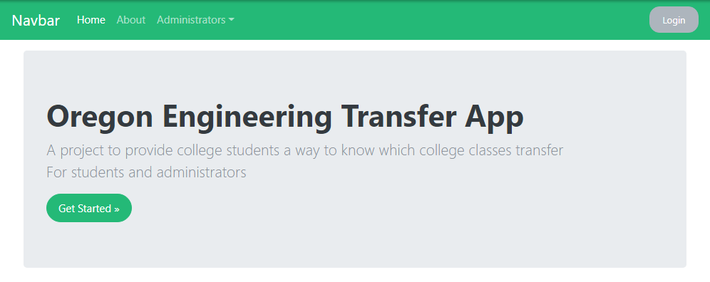
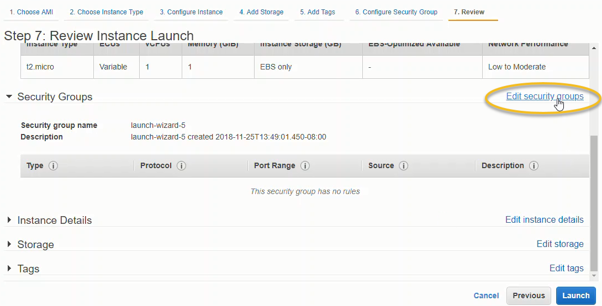
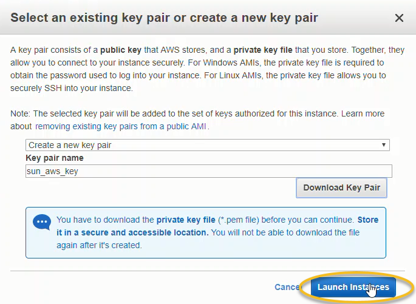
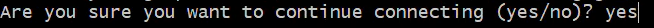

# Deployment on AWS

In this section, we are going to deploy the Oregon Engineering Transfer App on Amazon Web Services (AWS). More specifically, we are going to deploy this Django web app on an AWS EC2 instance. An instance is AWS speak for a virtual private server. This same type of virtual private servers are available from Digital Ocean and Linode. AWS calls them EC2 _instances_. Digital Ocean calls them _Droplets_.

 An advantage of AWS, compared to Digital Ocean or Linode, is a free trier which includes one EC2 instance (one server). Therefore, running our Django App running on AWS should be free.

The steps to deploy our Django App on AWS are a slight modification of a procedure from [Coding Dojo](https://www.codingdojo.com/). Coding Dojo hosts coding boot camps to get programmers ready for jobs quickly. Their coding bootcamps are 14 weeks long. The Coding Dojo bootcamps include Python, Django and Flask in the curriculum. 

A summary of steps to deploy our Django App on AWS is below:

[TOC]

## Sign up for Amazon Web Services (AWS) account

Sign up for an Amazon Web Services (AWS) account here:

 > [https://aws.amazon.com/](https://aws.amazon.com/)

We will use the AWS free tier to deploy this Django project. Once you sign up for an account, you have to go to your email and activate your aws account. After your account is active, log into AWS by clicking the [Sign into Console] button.


Once signed in, you are greeted by the ASW managment console:


## Update requirements.txt and push to GitHub

Back at the local machine, open the Anaconda Prompt and activate the ```(transfer)``` virtual environment. Then ```cd``` into the ```transfer``` project. Use ```pip freeze``` to create a ```requirement.txt``` file. On Windows, the command ```pip freeze > requirements.txt``` was needed. Note the ```>``` character in the middle of the command. The ```requirements.txt``` file contains all the Python packages used in the ```(transfer)``` virtual environment.

Later, we will install these same Python packages on the server. 

```text
$ conda activate transfer

(transfer)$ cd transfer
(transfer)$ pwd
/home/Documents/transfer
(transfer)$ ls
courses/           docs/       pages/            templates/
db.sqlite3         LICENSE     README.md         transfer_project/  manage.py*  users/

(transfer)$ pip freeze > requirements.txt
```

Take a look at the ```requirments.txt``` file. Ensure the file contains Django, django-crispy-forms and django-bootstrap. A partial listing of the ```requirements.txt``` file is below:

```text
certifi==2018.10.15
Click==7.0
Django==2.1.2
django-crispy-forms==1.7.0
Jinja2==2.10
livereload==2.5.2

...
```

Add, commit and push the changes to GitHub. 

```
(transfer)$ git add .
(transfer)$ git commit -m "updated requirements.txt"
(transfer)$ git push origin master
```

Do a quick check that the Django project runs without errors and works as expected on the local machine. 

If the Django project doesn't run on the local machine, there is no way the Django project will work on the AWS server. Start the development server on the local machine with the command:

```text
(transfer)$ pwd
# make sure manage.py is in the current working directory

(transfer)$ python manage.py runserver

Django version 2.1.2, using settings 'transfer_project.settings'
Starting development server at http://127.0.0.1:8000/
Quit the server with CTRL-BREAK.
```

Point a web browser to:

 > [http://localhost:8000/](http://localhost:8000/)

See the Oregon Transfer App in all it's glory:



Use [Ctrl]-[c] to shut down the development server

The following tasks are now complete:

 * ```requirements.txt``` created
 * changes pushed to GitHub
 * the Django App runs locally as expected with no errors. 

Now close the Anaconda Prompt. We'll use the Git Bash terminal (instead of the Anaconda Prompt) later in the deployment.

## Create and log into the AWS instance

Log into the AWS Web Console at the following link:

 > [https://aws.amazon.com/console/
](https://aws.amazon.com/console/
)


In the AWS Console window select Service --> Compute --> EC2 --> Launch Instance.


Scroll down the operating system options and select ```Ubuntu Server 16.04 LTS (HVM), SSD Volume Type```. This option is part of the AWS free tier.


Choose [select] then [Review and Launch].


Before we [Launch] the final server, we need to edit the security group options. Scroll down and select [Edit Security Groups]



Add the following security options:

SSH - your personal IP, auto-populates
HTTP - Anywhere, all IPs
HTTPS - Anywhere, all IPs


After the three security rules are added, click [Review and Launch]

At the review screen, click [Launch]


In the pop-up window, select [Create a New Key Pair] from the dropdown menu. 


Move the ```.pem``` key from the ```Downloads``` folder to a known location. Note the location where the ```.pem``` key file was moved to. We will need to ```cd``` into that location to log into the server.

Finally, click the [Launch Instances] in pop-up box. 



You will see a status window that shows your instances are launching. It takes a couple minutes for the instance to launch. 


Scroll down and click the [View Instances Button]


You can change the instance name by clicking the pencil icon in the [name] field.


Select the instance (box to the left of the instance name turns blue when instance is selected) and click [Connect]


Copy the SSH connection command from the pop-up window. We will run a modified version of this command in the Git Bash prompt.


Open the Git Bash Prompt, and ```cd``` into the directory where the ```.pem``` file from earlier was saved. Run the ```ls``` command and make sure the ```.pem``` file downloaded earlier is present. 


Copy the SSH login command from the AWS console pop-up window into the Git Bash prompt. The left mouse button can be used to paste.


Enter ```yes``` at the prompt to connect.



You will see the terminal prompt for the AWS server in the command window. Type the ```pwd``` command to print the current working directory. You should be in the ```/home/ubuntu``` directory.

```text
# on server
$ ls
/home/ubuntu
```


We have now completed the following steps:

 * launched a new AWS EC2 instance
 * logged into our new AWS EC2 intance

## Update the server

After the AWS server is created, the operating system and installed packages on the server should be updated. Run the following commands in the Git Bash window

```text
$ sudo apt-get update

$ sudo apt-get upgrade
```

When asked ```What would you like to do about modified configuration file grub?``` Type ```1``` to choose ```install the package maintainer's version``` 


After all the operating system and installed packages are upgraded, run the command ```sudo apt-get update``` again. You should see that updates are 100 percent complete.


## Install packages with apt

Now that the server and and the server's installed packages are up-to-date, we can install the packages we need to get the Django app up and running. Run the following commands:

```text
$ sudo apt-get install python-pip python-dev nginx git tree curl wget
```

Type ```y``` to confirm the installation. After the packages are installed, run ```apt-get upgrade``` again to make sure the packages we installed are up-to-date.

```text
$ sudo apt-get upgrade
```

## Clone the GitHub repo

```text
$ git clone https://github.com/ProfessorKazarinoff/Oregon-Engineering-Transfer-App.git repo_name
```

##  Install virtualenv

```text
$ sudo pip install virtualenv
```

## Create a new virtual environement

```text
$ cd repo_name
$ ls
manage.py requirements.txt
$ virtualenv venv --python=python3
$ source venv/bin/activate
```

## Install Python packages

```text
$ pip install -r requirements.txt
```

The packages we need are below. When these are pip installed, the terminal window should output ```requirement already satisfied```

```text
$ pip install django
$ pip install django-crispy-forms
$ pip install django-bootstrap4
```

## Install gunicorn, bcrypt and django-extensions

```text
$ pip install gunicorn
$ pip install bcrypt django-extensions
```

## Modify ```settings.py```

```text
$ cd transfer_project
$ ls
$ nano settings.py
```

Add the AWS instance IP address to the allowed hosts, set debug to False.

```text
#transfer_project/settings.py
DEBUG = False
ALLOWED_HOSTS =['aws instance IP address']
```

At the bottom of ```settings.py``` add a line for the static root file path:

```text
# At the bottom of /transfer_project/settings.py

STATIC_ROOT = os.path.join(BASE_DIR, "static/")
```

Ctrl-x to and [yes] to save and exit

## Collect Static

```text
$ cd ~/repo_name
$ python manage.py collectstatic
```

## Test gunicrn

```text
$ gunicorn --bind 0.0.0.0:8000 transfer_project.wsgi:application
deactivate
```

## Create gunicorn.service file

```text
$ sudo vim /etc/systemd/system/gunicorn.service
```

Fill out the ```gunicorn.service``` file as below:

```text
[Unit]
Description=gunicorn daemon
After=network.target
[Service]
User=ubuntu
Group=www-data
WorkingDirectory=/home/ubuntu/repo_name
ExecStart=/home/ubuntu/repo_name/venv/bin/gunicorn --workers 3 --bind unix:/home/ubuntu/repo_name/transfer_project.sock transfer_project.wsgi:application
[Install]
WantedBy=multi-user.target

```

## Run gunicorn service

```text
$ sudo systemctl daemon-reload
$ sudo systemctl start gunicorn
$ sudo systemctl enable gunicorn
$ sudo systemctl status gunicorn
```

## Create nginx configuration
   
```  text 
$ sudo vim /etc/nginx/sites-available/transfer_project
```

Fill out the ```transfer_project``` file as below:

```text
server {
  listen 80;
  server_name AWS_server_IP_no_quotes;
  location = /favicon.ico { access_log off; log_not_found off; }
  location /static/ {
        root /home/ubuntu/repo_name;
  }
  location / {
        include proxy_params;
        proxy_pass http://unix:/home/ubuntu/repo_name/transfer_project.sock;
  }
}

```

## Link the nginx configuration and restart nginx

```text
$ sudo ln -s /etc/nginx/sites-available/transfer_project /etc/nginx/sites-enabled
$ sudo nginx -t
#should be no errors
$ rm /etc/nginx/sites-enabled/default
$ sudo service nginx restart
```

## View site at AWS instance IP address

When everything works, browse to the IP address of the AWS instance. You see the following

[image of transfer app running](#)
