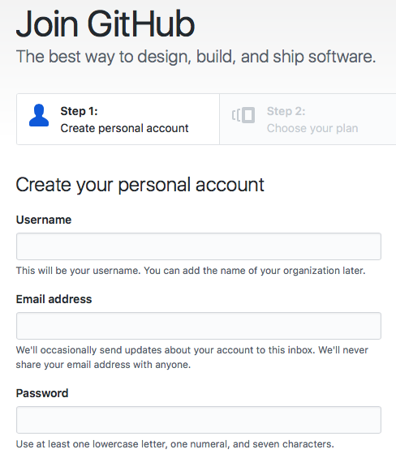

Title: Oregon Engineering College Transfer App - Part 2: Development Environment
Date: 2018-10-15 12:40
Modified: 2018-10-15 12:40
Status: draft
Category: django
Tags: python, django, web app
Slug: oregon-engineering-college-transfer-app-part-2-development-environment
Authors: Peter D. Kazarinoff
Series: Oregon Engineering College Transfer App
Series_index: 2
Summary: This is the second part of a multi-part series on building a web app with Python and Django. The web app will act as a resource for Engineering students at Oregon Community Colleges that want to transfer to 4-year Universities. The transfer web app will show which classes from their community college engineering program will transfer to which classes in a 4-year University engineering program. In this second post, I'll review the development environment I used to set up and build the web app. This includes installing the Anaconda distribution of Python, creating a GitHub repo, synching a local directory to the GitHub repo, installing packages, starting the project and running the project for the first time.

This is the second part of a multi-part series on building a web app with Python and Django. The web app will act as a resource for Engineering students at Oregon Community Colleges that want to transfer to 4-year Universities. The transfer web app will show which classes from their community college engineering program will transfer to which classes in a 4-year University engineering program. In this second post, I'll review the development environment I used to set up and build the web app. This includes installing the Anaconda distribution of Python, creating a GitHub repo, synching a local directory to the GitHub repo, installing packages, starting the project and running the project for the first time.

#Setting up the development environment

What does that even mean? Before I started building the Oregon Engineering Transfer App, I needed to make sure the necessary software, packages and settings were in place. This starts with setting up a _development environment_. To me, a development environment is simply the software on a computer that allows me to get work done. In this case the development environment means the tools necessary to build this site. A list of the tools and technologies are below:

1. An operating system: This web app was built on machines running Windows 10, Mac OSX and Linux (Ubuntu 16.04 LTS).
2. Python: Python 3.7 (legacy Python is version 2.7)
3. Anaconda: The Anaconda Prompt and the Anaconda Python distribution
4. GitHub.com and git: Four different computers were used build the site. GitHub is the central place where the most up-to-date version of the site is kept.
5. A virtual environment: A separate Python virtual environment that the web app will run in.
6. Django: a Python web framework
7. Pycharm IDE: a Python Integrated Development that I will use to build and test the web app.
8. Deployment Target: A place for the web app to run. Initially this will be on the Huroku free tier.


## An operating system

I am building the web app on at least four different computers depending on where I am. These computers include:

* Windows 10 Desktop at work

* Mac OSX laptop at home

* Windows 10 laptop at home

* Linux (Ubuntu 16.04 LTS) Desktop at home. 

Regardless of which computer I am using for development, the files that make up the web app will be the same because I'm using Git and GitHub.com to keep everything synced. I will also keep my virtual environments the same on each computer.

An advantage of using the Anaconda distribution of Python is that each of these four computers will have the same stable version of Python. 

Download the latest release at:

[https://www.anaconda.com/download](https://www.anaconda.com/download/)

The Anaconda distribution of Python comes with an up-to-date and stable version of Python (Python 3.6, byt Python 3.7 can be specified during the creation of a virtual environment) and the **Anaconda Prompt**. The **Anaconda Prompt** is useful because it allows me to run shell commands on my Windows 10 machines. These are the same commands I would run in the terminal on my MacOS or Linux boxes. The **Anaconda Prompt** makes creating and activiting virtual environments easy and allows me to use git on Windows 10. Follow this post to [install the Anaconda on Windows 10.](https://pythonforundergradengineers.com/installing-anaconda-on-windows.html)

 
### Create a new virtual environment

Before installing Django, we should create a new virtual environment. The same virtual environment on each of the computers I use means the same packages are installed on each computer. To create a new virtual environment, open up the Anaconda Prompt (on Windows) or a terminal (on Linux or Mac OSX). Let's call our new virtual environment ```transfer```. The ```conda create``` command creates the environment and the ```-n staticsite``` flag adds the name. ```python=3.7``` sets the Python version at 3.7.

```text
$ conda create -n transfer python=3.7
```

This command creates a new virtual environment called ```(transfer)```. Becuase I use four different computers to work on the site, I need to make sure the same Python packages are installed on each computer. Using a virtual environment ensures this consistency. Once the virtual environment ```(transfer)``` is created, we need to activate it and start using it with the command:

```text
$ conda activate transfer
```

Now  we see ```(transfer)``` before the terminal prompt. This means we are using the ```(transfer)``` virtual environment.

## Install Django

Time for some fun! Installing Django. Django mature web framework built in Python. Django is included in the default Anaconda channel. The install command is:

```text
(transfer)$ conda install django
```

Once ```django``` is installed, we can install ```django-crisy-forms```. This package will help us build and use web forms in the Django framework. The docs for the Oregon Transfer App are built with a static site generator called [MkDocs](https://www.mkdocs.org/) and theme called [mkdocs-material](https://squidfunk.github.io/mkdocs-material/). These packages can all be installed with ```pip```.

```text
(transfer)$ conda install django
(transfer)$ pip install django-crispy-forms
(transfer)$ pip install mkdocs
(transfer)$ pip install mkdocs-material
```

## Create a GitHub account and create a new repository

We need to keep track of **_version control_** while building the Oregon Transfer App and allow other people to work on the App as well.

Therefore, we'll use **git** and **GitHub** for verson control. **Git** is a command line utility that assists with version control. Using git means changes made to files on one computer can be synced with the same files on another computer. **GitHub.com** is the where the Oregon Transfer App code is remotely stored and integrates easily with git. 

Sign up for a GiHub.com account here:

[https://github.com/join](https://github.com/join)

The account activation screen looks something like:



Once the account is set up, login and create a new repository. Use the + button on the upper right-hand menu:


I named the repository: **Oregon-Engineering-Transfer-App** and included both a **README.md** and a **GNU General Public License v3.0**. Make sure to include a **.gitignore** file as well. Select [Python] in the .gitignore dropdown options.


Once the repo is created, we need to modify the ```.gitignore``` file some more. We want to make sure that any Django files we need to ignore are kept out of git and any of the documentation site files are kept out of git (the documentation source files should stay in git). Edit the .gitignore file on the GitHub repo page. Click on the .gitignore file in the file browser and click the pencil icon in the upper right to edit. Once edits are complete click the green [Commit Changes] button at the botton.

A link to the .gitignore for the Oregon Engineering Transfer App project is [Here](https://github.com/ProfessorKazarinoff/Oregon-Engineering-Transfer-App/blob/master/.gitignore)

## Make a directory for the Oregon Engineering Transfer App and link to GitHub

Once the GitHub repo (short for repository, basically a folder with files on GitHub.com) is set up, the last step to complete the development environment is to link the remote repo on GitHub to the local version of the site on my computer. 

The local version is in a folder call ```transfer``` in the ```Documents``` folder. The ```transfer``` folder will contain all the code used to build the Oregon Engineering Transfer App.

```text
(transfer)$ cd Documents
(transfer)$ mkdir transfer
(transfer)$ cd transfer
```

We can set up git to keep the contents of the local ```tranfer``` folder in sync with the contents of the ```Oregon-Engineering-Transfer-App``` repo on GitHub.com. The command ```git init``` will initiate or create the local repository. The command ```git remote add origin``` followed by the url of our github repo links local folder to the remote repo on github. Note the web address ends in ```.git```.

```text
(transfer)$ git init
(transfer)$ git remote add origin https://github.com/ProfessorKazarinoff/Oregon-Engineering-Transfer-App.git
```

Now for the git magic. On GitHub.com we have a ```README.md``` file and a licence. But the local ```transfer``` folder on my laptop is empty. So the two folders aren't in sync. To make the contents of each folder identical, we **_pull_** the files from GitHub onto the local computer. A **_pull_** "pulls" or gets the files from GitHub and copies them to the local ```transfer``` folder.

```text
(transfer)$ git pull origin master
```

If we look in the local ```transfer``` folder, we see the following three files:

```text
transfer/
├── LICENSE
├── .gitignore
├── README.md
```

The development environment for the Oregon Transfer Web App is set! On to building the App!

Now each time I work on the App, I navigate to the ```transfer``` folder on whatever computer I am using. Before any editing, I key in the command:

```text
$ git pull origin master
```

After the _pull_, the ```transfer``` folder is up-to-date with the newest version of all the files on GitHub. Then I go about editing code, adding templates, changing settings, etc. After the edits, the last thing I do before shutting down the computer for the day is add all the changes to git with ```git add .``` (note there is a space between the ```add``` and the period ```.```). Then commit those changes locally with the line ```git commit -m "commit message"``` (note there are double quotes ```"commit message"``` used around the commit message), and finally push the changes up to github.com with ```git push origin master```. Now the code for the Oregon Engineering Transfer App up on GitHub.com is the same as the code saved on my local machine.

```text
git add .
git commit -m "commit message"
git push origin master
```

This ensures all of my local computers and the GitHub repo contain the same version of the App.

## Next Steps

The next step is to build the front page of the web app.
