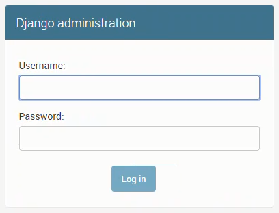
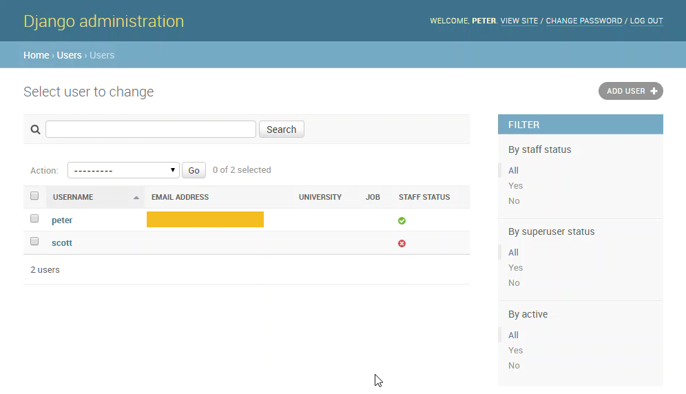

Title: Oregon Engineering College Transfer App - Part 5: User Model
Date: 2018-10-18 12:40
Modified: 2018-10-18 12:40
Status: draft
Category: django
Tags: python, django, web app
Slug: oregon-engineering-college-transfer-app-part-5-user-model
Authors: Peter D. Kazarinoff
Series: Oregon Engineering College Transfer App
Series_index: 5
Summary: This is the fifth part of a multi-part series on building a web app with Python and Django. The web app will act as a resource for Engineering students at Oregon Community Colleges who want to transfer to 4-year Universities. The transfer web app will show which classes from their Community College Engineering program will transfer to which classes in a 4-year University Engineering program. In this fifth post, we'll build a user model that will allow us to add new users, allow users to login, and allow users to logout. We'll test this user model with the Django admin.

Summary: This is the fifth part of a multi-part series on building a web app with Python and Django. The web app will act as a resource for Engineering students at Oregon Community Colleges who want to transfer to 4-year Universities. The transfer web app will show which classes from their Community College Engineering program will transfer to which classes in a 4-year University Engineering program. In this fifth post, we'll build a user model that will allow us to add new users, allow users to login, and allow users to logout. We'll test this user model with the Django admin.

[TOC]

## What is a user model?

The Oregon Transfer App has two purposes. The first purpose is to be a website that Community College students can use to see which classes at their Community College transfer to a specific 4-year University in Oregon. The second purpose is to be a place where administrators at 4-year Universities can post transfer class equivalencies. The 4-year University administrators _set_ which classes transfer, and the students _see_ which classes transfer. We need to build a user model so that the 4-year university administrators can login, then build and modify transfer equavalencies. Students (or any other user) will not have to login to see which classes transfer. Students (or any other regular user) will not have the ability to _set_ which classes transfer, just _see_ which classes transfer. So a user model for the 4-year University administrators is needed.

## What do users need to be able to do?

The 4-year University administrators need to be able to do a couple things:

### Transfer App site privileges

 * log into the Transfer App website
 * Create a new 4-year University
 * Create and edit classes at their 4-year University
 * Create and edit classes at 2-year Community Colleges
 * Create and edit which community College Classes are equivalent to which University classes

### Transfer App user actions

 * Create a new user, set username and password
 * Log in
 * Log out
 * Reset password
 * Retrieve forgetten password
 * Maybe set and update a profile?

We'll build some of these Transfer App user actions in this post.

## Create the users app

At the Anaconda Prompt activate the ```(transfer)``` virtual environment and run the ```startapp``` command to create a new Django app in our Django project. We already have a **pages** app in our project. Now we need to add a **users** app to the project.

```text
$ cd tranfer_project
# make sure you are in the project base directory
$ conda activate transfer
(transfer)$ python manage.py startapp users
```

## Create a user model

There are a couple steps needed to get our user model working. We need to update the project settings.py file so that our user app is included in the list of install apps. Then we'll create the user model in our users app.

### Add user app to list of installed apps

Now we'll add our user app to the list of installed apps. To do this, we need to edit the settings.py file in the overall transfer_project folder.

```python
# transfer_project/settings.py

# Application definition

INSTALLED_APPS = [
    # project specific
    'pages.apps.PagesConfig',
    'users.apps.UsersConfig',
    
    # django
    'django.contrib.admin',
    'django.contrib.auth',
    'django.contrib.contenttypes',
    'django.contrib.sessions',
    'django.contrib.messages',
    'django.contrib.staticfiles',

    # 3rd party
    
]

```

Also define the ```AUTH_USER_MODEL``` in the same settings.py file

```python
# transfer_project/settings.py

AUTH_USER_MODEL = 'users.CustomUser'

```

### Create the users model in the users app

Now we need to create the users model in the users app.  Add a new ```CustomUser``` class derived from the ```AbstractUser``` base class in the users/models.py file

```python
# users/models.pyu

from django.contrib.auth.models import AbstractUser
from django.db import models

class CustomUser(AbstractUser):
    university = models.CharField(CharField.max_length=30, null='', blank=True)
    job = models.CharField(CharField.max_length=30, null='', blank=True)

```

## Create a users form in users/forms.py

Now we need to create a form in the users app forms.py file. This form will allow new users to be created and exiting users to change.

```python
# users/forms.py

from django import forms
from django.contrib.auth.forms import UserCreationForm, UserChangeForm

from .models import CustomUser


class CustomUserCreationForm(UserCreationForm):
    model = CustomUser
    fields = UserCreationForm.Meta.fields + ('university','job',)


class CustomUserChangeForm(UserChangeForm):

    class Meta:
        model = CustomUser
        fields = UserChangeForm.Meta.fields

```

## Add user creation and user change forms to the Django admin

In order to use the Django admin to add and modify users, we need to add our user creation form and add our user change form to the users/admin.py file.

```python
# users/admin.py

from django.contrib import admin
from django.contrib.auth.admin import UserAdmin

from .forms import CustomUserCreationForm, CustomUserChangeForm
from .models import CustomUser


class CustomUserAdmin(UserAdmin):
    add_form = CustomUserCreationForm
    form = CustomUserChangeForm
    model = CustomUser


admin.site.register(CustomUser,CustomUserAdmin)

```

## Make migrations and migrate

We made changes to the database, so before we start the local server and see if our user model works, we need to ```makemigrations``` and ```migrate``` the database changes.

```text
(transfer)$ python manage.py makemigrations users
(transfer)$ python manage.py migrate
```

I had problems with this command and was returned the error

```text
django.db.migrations.exceptions.InconsistentMigrationHistory: Migration admin.0001_initial is applied before its dependency users.0001_initial on database 'default'
```

Running the command below didn't solve the problem.

```text
(transfer)$ python manage.py makemigrations --merge
```

Commenting out the django.admin app from the list of installed apps didn't work either.

```python
# transfer_project/settings.py

# django
    #'django.contrib.admin',
    'django.contrib.auth',
```

I also tried deleting the  users.0001_initial.py file from the user app migrations folder. That worked for the makemigrations step, but it didn't work for the migrate step.

The thing that eventually worked was deleting the db.sqlite3 file in the base project directory and then running the commands again. 

```text
(transfer)$ python manage.py makemigrations users
(transfer)$ python manage.py migrate
```

Running makemigrations and migtrate created a new db.sqlite3 file and seems to work. Once users are created, this is obviously a poor solution. We don't want to erase the entire database each time we make a change to the app, but erasing the database worked to solve the problem right now. 


## Create a super user at the command line

We need to create a super user at the command line so that we can log into the Django admin. With no users set up yet, there is no way to log into the Django admin and see if our user model works.

```text
(transfer)$ python manage.py createsuperuser
```

You'll be asked for a username, email address and password. Note that the email address we use has to be different from the email address that will eventually be used with the email service.

## Start the local server and log into the Django Admin

Now let's see if our user model worked. Run the Django project locally with:

```text
(transfer)> python manage.py runserver
```

Open up a web browser and browse to:

 > http://localhost:8000/admin

The Django admin looks something like below. Log in with the new superuser username and password that we just set up.



After logging in with the superuser credentials, the Django admin dashboard pops up.


## Create users with the django admin

Using the Django admin dashboard, create a new user by clicking the [+user] button.


## Modify the user app admin.py to include the fields 'job' and 'university'

We can only see USERNAME, EMAIL ADDRESS, FIRST NAME, LAST NAME, and STAFF STATUS when we look at the Django admin pannel. Our custom fields 'university' and 'job' are not shown. To make these show up, we need to modify the /users/admin.py file and include a list_disply of all the fields we want shown.

```python
# users/admin.py

from django.contrib import admin
from django.contrib.auth.admin import UserAdmin

from .forms import CustomUserCreationForm, CustomUserChangeForm
from .models import CustomUser


class CustomUserAdmin(UserAdmin):
    add_form = CustomUserCreationForm
    form = CustomUserChangeForm
    model = CustomUser
    list_display = ['username','email','university','job','is_staff']


admin.site.register(CustomUser,CustomUserAdmin)
```

Restart the server with

```text
(transfer)$ python manage.py runserver
```

Browse to the user dashboard and see the new fields presented.



## Summary

That was a ton of work, but we got the new user model working. We created the users app, added a user model to the users app and then incorporated the user model into the Django admin. Then we ran the Django admin and created a new user. Finally we modified the users/admin.py file so that we could see our custom fields 'university' and 'job' listed on the Django admin users pannel

## Future Work

Next, we'll incorporate a way for users to log in. We have the ability to create new users through the Django admin pannel. Now we need a way for those users to log in and out of the site. 
